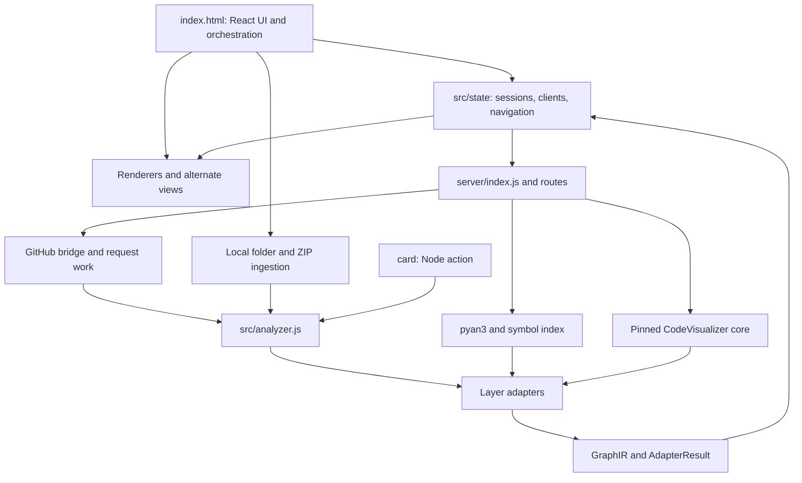
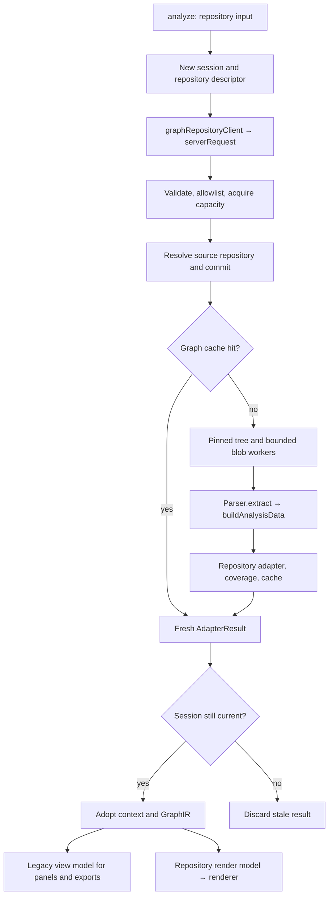
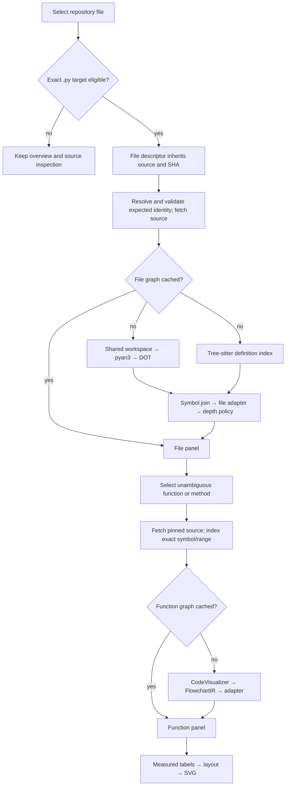
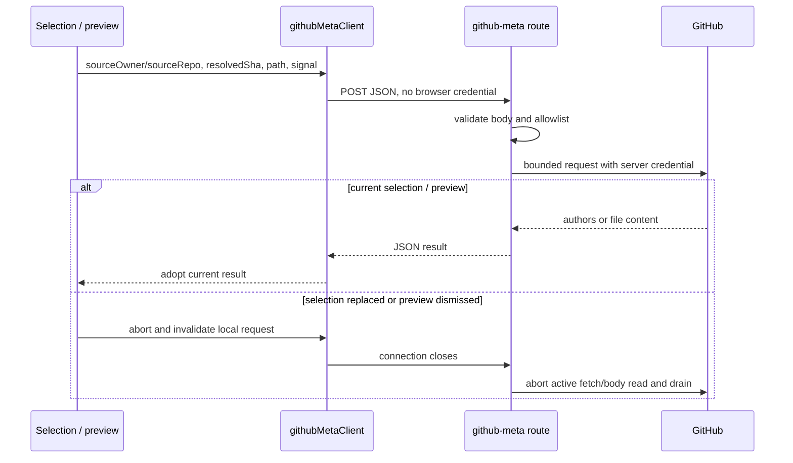
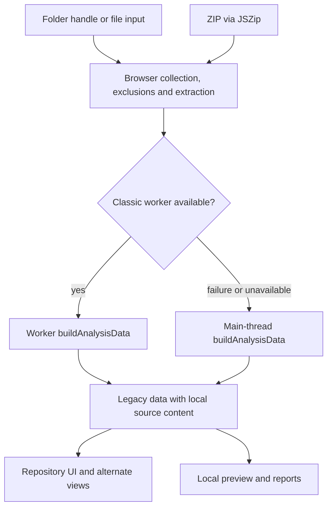

# Codeflow architecture

Source-inspected at `7ce7aa8020bc9bdf0c70648d175632e19f65b7d6` on October 4, 2026. Start with the [documentation index](README.md). This is the mapping portion of [#30](https://github.com/OwenTanzer/codeflow/issues/30), not approval to refactor or acceptance of every product workflow. [Validation and profiling](architecture-profiling.md) distinguishes new measurements from release evidence; [next steps](architecture-next-steps.md) ranks implementation proposals.

## Component boundaries

GraphIR means **Graph Intermediate Representation**; FlowchartIR is the upstream function parser's control-flow representation. The shared envelope does not make the three layers semantically interchangeable.

| Boundary / runtime | Actual entry points and responsibility | Inputs → outputs; identity and failure behavior |
| --- | --- | --- |
| Browser shell | [index.html](../index.html): module bridge, classic `text/babel` script, `App`, `FileLayerPanel`, `FunctionLayerPanel`, `RepositoryGraphView`, previews, Inspector, search, exports and alternate views | UI intent → state/client calls/render lifecycle. Owns `data`, `repositoryGraph`, pending/active sessions, generation guard and graph cache. React error boundary and panel errors isolate visible failures; not every alternate view has equivalent semantic acceptance. |
| Original analyzer, browser and Node | [src/analyzer.js](../src/analyzer.js): `Parser.extract`, `buildAnalysisData`, `calcBlast`, `calcHealth`, `runAnalysisData` | Parsed file records + functions → legacy aggregate analysis. Parser availability is runtime-dependent; provenance distinguishes Acorn/tree-sitter from heuristics. Java/Kotlin overview is not semantic file/function support. |
| HTTP composition, Node | [server/index.js](../server/index.js): `main`, route factories, static/health/capability routing | Creates shared config, caches, limiter, metrics and workspace manager; initializes dependencies. API routes have no app authentication gate; GitHub token remains server-held. Allowlist and rate limits are controls, not user authorization. |
| Retrieval, Node | [github-analyzer-bridge.js](../server/lib/github-analyzer-bridge.js): `resolveGithubRef`, `fetchAndAnalyzeRepo`, `resolvePathEntry`, `fetchAllContents` | Request identity → immutable SHA, tree/blob contents, analyzer result and coverage. Forked PR source repository differs from requested base. Invalid/truncated trees, byte-budget violations and retrieval failures are explicit errors, not partial sampled success. |
| Repository conversion, neutral JS | [repositoryGraphAdapter.js](../src/adapters/repositoryGraphAdapter.js): `adaptRepositoryAnalysis` | Legacy analysis → files/relationships/groups in GraphIR, with parser provenance and aggregate metadata. [repositoryGraphToViewModel](../src/adapters/repositoryGraphToViewModel.js) reconstructs legacy UI fields; this is an intentional compatibility boundary. |
| File analysis, Node/Python | [graph-file.js](../server/routes/graph-file.js): `createGraphFileHandler`, `runSharedPyan3Analysis`; [pyan3Adapter](../server/lib/pyan3Adapter.js), [pythonSymbolIndex](../server/lib/pythonSymbolIndex.js), [pyanSymbolJoin](../server/lib/pyanSymbolJoin.js) | Pinned `.py` file/package → staged pyan3 subprocess/DOT + definition index → joined symbols/edges → [file adapter](../src/adapters/fileGraphAdapter.js) → depth-selected GraphIR. pyan3 failure can yield a warned tree-sitter-only graph when enabled; it is not cached. |
| Function analysis, Node/WASM | [graph-function.js](../server/routes/graph-function.js): `resolveFunctionSymbol`, `classifyFunctionRangeFailure`, `createGraphFunctionHandler` | Pinned file + exact scoped symbol → indexed range → `analyzePythonFunction` → FlowchartIR → [function adapter](../src/adapters/functionGraphAdapter.js). Missing/ambiguous/nonfunction targets fail; there is no substitute parser fallback. |
| Shared contracts, neutral JS | [src/graph-ir](../src/graph-ir/index.js) and [contract](graph-ir-contract.md) | Context, coordinates, schema validation, diagnostics, navigation intent and cache identity. No UI/server imports. `codeUnitOffset.js` is a separate direct import, not exported from the barrel. |
| Browser clients/state | [AnalysisSession](../src/state/analysisSession.js), layer clients, [serverRequest](../src/state/serverRequest.js), [selection](../src/state/selection.js), [repositoryDrillDownPanel](../src/state/repositoryDrillDownPanel.js) | Requests → AdapterResult/errors, with AbortSignal and current-generation checks. Common JSON transport adds no Authorization header; individual clients retain request-shaping responsibility. |
| Rendering, browser | [repository](../src/render/repositoryGraph.js), [file](../src/render/fileGraph.js), [function](../src/render/functionGraph.js) renderers and their render models | GraphIR or supported legacy input → layout/SVG, selection and navigation callbacks. Renderers own simulation/DOM listeners; callers must invoke returned cleanup. Function geometry uses measured full text, not truncated labels. |
| Card, Node/CommonJS | [card/index.js](../card/index.js), [card/lib/analyzer.js](../card/lib/analyzer.js), [collect.js](../card/lib/collect.js) | Checked-out files + Git history → same analyzer aggregates → SVG/state/optional PR receipt. Loads the action's own analyzer, never executable analyzer code from the target repository. No GraphIR drill-down or server credential/cache lifecycle. |

## Browser startup and analyzer compatibility

`index.html` loads React/ReactDOM 18.2.0, Babel standalone 7.23.5, D3 7.8.5, d3-sankey 0.12.3, Acorn 8.11.3, JSZip 3.10.1, web-tree-sitter 0.20.8, jsPDF 2.5.1 and Mermaid 10.9.1 from content delivery networks (CDNs). The `3d-force-graph` URL is **unversioned**. These are distinct from npm dependencies: server Acorn is resolved to 8.17.0, not the browser's 8.11.3. Fonts and grammar assets also require availability; local analysis does not establish an offline-packaged application.

The module script imports analyzer exports and selected render/state helpers, then `Object.assign(window, analyzer, {...})` exposes them to the separate Babel script. `fetchCapabilities`, `fetchBlame` and `fetchFileContentFromServer` are now explicitly bridged. Vite bundles the module side; it does not convert the entire remaining Babel application into ordinary imported components. Startup order and global names remain a real compatibility seam. Protect it with `drill-down-capabilities-bridge.test.mjs` and real dev/build startup checks, not only import tests.

The analyzer's worker path is unusual but live: `createAnalysisWorkerSource` fetches `import.meta.url`, extracts the `CODEFLOW_CORE_START/END` source slice and inserts it into a classic Blob worker with `importScripts`. `runAnalysisData` sends already collected/parsed records to `buildAnalysisData`; collection and initial extraction are not thereby moved wholesale off the main thread. Worker completion/error terminates the worker and revokes the object URL. Worker construction/source failure falls back to main-thread aggregation. This API has no AbortSignal for externally preempting a superseded local worker, and local completion handlers do not check the shell generation before adopting results. Local stale-result protection is not established. Its source markers, ambient parser globals and built output must survive any extraction.

Node GitHub analysis installs Acorn and the shared tree-sitter runtime before importing/using the analyzer. `webTreeSitterRuntime.js` centralizes initialization used by `node-tree-sitter-shim.js` and `pythonSymbolIndex.js`; avoid a second independent initialization of the same package. The original analyzer still contains the legacy `GitHub` client used by the PR dialog below. Card/local/server parser capabilities are not identical merely because their source module is shared.

## Repository load

The main Analyze button currently calls `describeRepositoryRequest(undefined, undefined, ...)`; server/client support for explicit refs/PRs does not prove pasted `/tree/ref` handling. The server resolves first, then reads the graph cache. A hit still consumes admission capacity and a ref lookup, but avoids tree/blob retrieval and parsing. `server/lib/graph-request-context.js` owns `buildRequestContext` and `cacheKeyRequestIdentity`, imported directly by all three graph routes. The repository route retains compatibility re-exports of the same functions. `buildRequestContext` preserves requested identity and resolved source identity. Content is fetched using the immutable SHA/blob SHA, never by a mutable branch during the scan.

Repository GraphIR retains `metadata.functions` (including function code) and aggregate analysis. It omits whole-file `content`; it is **not source-free**. `stripCodeFromFnStats` already removes a duplicate copy of function code, and the inverse mapper rehydrates it by function key. The primary graph renderer consumes GraphIR directly through `buildRepositoryRenderModel`; other panels, reports and alternate views consume the reconstructed legacy `data`. This is a fan-out, not invariably GraphIR → legacy model → renderer. Render models coalesce relationships for display; GraphIR retains the more specific relationship records.

Parser degradation, oversized skips and graph completeness are different signals. Repository Python grammar degradation is reflected in provenance/partial reporting and may be cached under the capability-specific key. Coverage records selected/analyzed/skipped/failed counts; inspect that alongside warnings. Server repository scans have no count cap, but retain all [resource policy](deployment.md#repository-overview-resource-policy-29) budgets and exclusion rules.

### Important exception: legacy PR Impact dialog

`index.html`'s `analyzePR` is still called by the PR URL control. It uses `GitHub.resolvePR` and `analyzePRHead`, which call browser-side `GitHub.scan/getFile/getCommits`, apply `ANALYSIS_LIMITS.repoMax` (750), aggregate locally and adapt under `codeflow-pr-head-adapter@1.2.0`. The token-entry UI is gone; this path does not inherit the server-held credential. Its churn fetch does not pass the pinned ref, and it does not create/adopt a new `AnalysisSession` like the main Analyze path. These are source-observed divergences, not freshly reproduced runtime failures. Do not extend the uncapped/server-authoritative release claim to this dialog, or infer private PR support. Reconciliation needs a separate functional scope and acceptance decision; no runtime repair is included here.

## Repository → file → function

Clients use base owner/repo plus resolved SHA for ordinary child requests; PR requests preserve the PR number and expected source/SHA triple. `assertRevisionStillExpected` rejects a moved PR or changed source with 409 rather than silently rebasing a drill-down. File routes fetch only the requested file/subtree. A file cache hit occurs **after retrieval**; it saves pyan3/index/join/adaptation, not the network phase. In-flight deduplication shares pyan3 work across depth modes, not entire HTTP requests or retrieval. Each subscriber can cancel; the subprocess is aborted when no subscribers remain. Workspaces belong to the shared operation and are cleaned in `finally`, after pyan paths become repository-relative.

`joinPyanToSymbols` separates matched, symbol-only, unresolved and ambiguous records. Symbol-only definitions can have exact locations without known call relationships; unresolved/ambiguous nodes must not invent coordinates. File semantics are definitions/uses within the staged scope, not a full-program dynamic call graph. [File limitations](file-layer-limitations.md) retains the missing external-call and last-definition-wins caveats. Depth modes are explicit policy, not a new repository sampling mechanism.

Function lookup fetches source and indexes symbols before its cache check. It resolves scoped names without guessing and converts line/column positions using `codeUnitOffset.js`: despite upstream `startByte/endByte` names, this binding uses UTF-16 code units, not UTF-8 byte counts. CodeVisualizer parsing is in-process and synchronous CPU work; request cancellation can be checked before/after but cannot preempt a parse mid-call. The retrieval timeout is not a hard wall-clock interrupt for that parser. A range failure with overlapping syntax errors becomes `parser_failure`; a clean target whose conversion disagrees becomes `malformed_analyzer_output`.

At pin `ea0f56d`, the adapter accepts version-1 `rawLabel` with `python-parser-composition` provenance. It does not fabricate missing text. `labelGeometry.js` and `functionRenderModel.js` size nodes and route links from complete labels; `functionGraph.js` measures the actual SVG font and reflows after resize/font changes while preserving search/selection. Function nodes describe control flow, not file-level call edges. No callee drill-down is promised. Confidence 1 is an adapter resolution convention, not proof of complete Python semantics (`for...else` remains a documented upstream limitation).

## Source/ownership inspection and replacement

Ownership is a tally of up to 50 commits by author, **not line-level git blame**. The selected graph's resolved source repository/SHA is passed to metadata requests. Whole-file preview uses embedded content for local analysis and the server fallback otherwise; response adoption checks dismissal/replacement. These endpoints share the global API rate limiter and request timeout/abort machinery but do not use graph cache, graph metrics or analysis concurrency admission. Their authorization check is on the requested source owner/repo, which matters for fork allowlists. Do not treat metadata as another graph layer.

A new repository/local load increments the shell analysis generation, cancels old pending/active sessions, clears graph cache and resets navigation/selection/preview. `AnalysisSession` adds per-layer generations and a repository epoch: a new repository invalidates all children; a new file invalidates function work. Every asynchronous graph adoption/error path must check currency. Server response-close detection triggers cancellation, `withTimeout` installs request-local work through AsyncLocalStorage, and `drainingMap` stops scheduling, aborts siblings and awaits settlement before releasing capacity. Noncooperative work continues to own its slot. A synchronous parser cannot service an abort until it yields.

The browser's `graphCacheRef` is a Map for the current analysis, keyed by response cache keys; it has no separate byte/TTL budget. Breadcrumb entries retain keys and selection so in-app Back restores graphs without refetch. Replacement clears the Map. `src/state/route.js` only persists repository/run query state with `replaceState`; coordinate-token support in the contract is not implemented native browser-history restoration of every layer.

## Local and server-filesystem analysis

Folder/ZIP contents are processed in the browser and not uploaded by this workflow. There is no genuine GitHub revision context, no fabricated GraphIR identity and no server file/function drill-down. Local selection does not fetch ownership. Local entry points increment the shell generation and invalidate existing server sessions, but their completion/error handlers do not check that generation; local stale-result protection and cancellation remain gaps, unlike the server-backed request flow. Browser dependency downloads still occur.

Separately, `POST /api/analyze` accepts a path already on the **server** under its repository root, copies a confined, symlink-checked tree into a workspace, uses `card/lib/collect.js` plus the original analyzer, returns legacy analysis and cleans up. It is not a browser folder-upload API. Its lifecycle has admission/cleanup but not the graph routes' full cancellation contract. `POST /api/analyze-repo` remains a legacy response-shape endpoint over the GitHub bridge; graph clients use `/api/graph/repository` instead.

## Server lifetime, cache and operations

`server/index.js` validates config/output/token/allowlist at startup, ensures workspace ownership and sweeps confirmed-dead instances' workspaces. `WorkspaceManager` owns restrictive filesystem handling; pyan subprocess timeout/cancellation and output-buffer limits live in `pyan3Adapter.js`. Cleanup errors are logged; do not promise impossible guaranteed deletion after process crashes.

The process shares one `GraphCache` across layers, one `Metrics` accumulator, one analysis `ConcurrencyLimiter` and file-only `InFlightRegistry`. GraphCache stores graph objects, rebuilding AdapterResult per request; LRU (least recently used) eviction, TTL (time to live), item and serialized-byte bounds are process-local. Its byte accounting is UTF-8 JSON size, **not measured retained heap**. Restart clears cache; replicas do not share it. Cache keys include source identity, schema, analyzer/version, coordinate and route options. Repository options add normalized excludes, byte budgets and Python parser capability; request mode/ref is included to keep response provenance distinct even at the same SHA. File depth belongs in the graph key but not the shared pyan work key. Function keys include the exact indexed range. See the [contract](graph-ir-contract.md) for canonical definitions.

`/healthz` reports build identity; `/readyz` reports dependency/workspace/cache/build checks and feature flags. Dependency statuses refresh every five minutes with metrics summaries; CodeVisualizer initialization status is startup-only because its parser initialization is memoized. The cache readiness probe uses an isolated tiny cache. Flags advertise operator enablement, not comprehensive semantic support. Structured logs correlate request/session/layer/result state and redact credentials. Read [deployment.md](deployment.md) for actual setup, limits, operational recovery and authorization requirements; no production check was performed for this guide.

## Build and extension recipes

The root `preinstall` and `build` both invoke `setup:codevisualizer`: verify the exact git pin, reset/clean only the disposable vendor checkout, run its root `npm ci`, then build `packages/core`. Even an already matching pin repeats install/build. `postinstall` provisions pyan3 2.6.2 best-effort into `.venv-pyan3`; its failure is not an npm failure. Vite builds the shell/module bundle, and build-info generation records revision/dirty status. CI's Build and test job runs root tests/build plus real server and construction smoke; it does not run all browser suites. Exact pins and update procedure live in [dependency notes](codevisualizer-core-dependency.md) and the [runbook](deployment.md).

| Extension | Smallest coherent path | Required contracts and gates | Broader decision boundary |
| --- | --- | --- | --- |
| Renderer | Add a pure layer render model if needed, a `src/render` lifecycle returning cleanup, bridge/wire the owning panel, use existing activation/navigation helpers | GraphIR kinds/coordinates, selection and origin intent; corresponding render-model tests; full-label geometry, font/resize/disposal and real browser navigation | A new graph meaning, automatic hiding/reduction or navigation semantics is product/design scope, not a renderer-only substitution. |
| Analyzer | Isolate runtime dependency/service, add adapter to GraphIR, wrap AdapterResult in the appropriate route, declare provenance/capability and cache version/options | Schema/coordinate fixtures; adapter and route failures; exact source range, cancellation/workspace cleanup; client capability and navigation tests | Language expansion, new error category/schema, subprocess/resource/security changes require explicit design and acceptance. Never reuse repository heuristic edges as function control flow. |
| Metadata field | Identify owning analyzer/route; add to node/graph metadata at adapter, then inverse mapper only if legacy consumers need it, then UI/export consumer | Adapter + view-model parity, null vs unknown semantics, payload/cache accounting, diagnostics redaction and affected export/source tests | Private source exposure, lazy API/detail loading, shared cache identity or required schema fields are separate contract decisions. |
| Original analyzer responsibility | Trace callers in browser, server, card and classic worker before moving code | Golden/baseline/parser-provenance/card-security plus worker verification in dev and build | Replacing ambient parser services or worker source extraction cannot be assumed a mechanical file move. |

Use the [test responsibility map and ranked plan](architecture-next-steps.md) before implementing any of these recipes.
